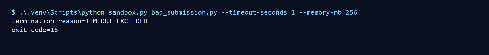

# Native Python Sandbox

Lightweight, cross-platform execution sandbox for untrusted Python challenge submissions. It runs contestant code in a child process, monitors elapsed runtime and memory usage with native Python plus `psutil`, and forcefully terminates runaway scripts before they can block the host machine.



## Why this project exists

OSIPI analysis challenges need a safe way to execute external Python submissions from researchers. Docker can help with reproducibility, but in practice it is often difficult to install or approve on hospital and research IT networks. This repository demonstrates a simpler path:

- native Python only
- zero container dependency
- cross-platform process supervision
- CLI-first workflow with built-in `/help` and `/examples`
- automated proofs that malicious scripts are terminated cleanly

This makes it a strong fit for a mentor request that emphasized lightweight and user-friendly execution over clunky infrastructure.

## What it does

- Launches a submitted Python script with `subprocess.Popen`
- Monitors the child PID and descendant processes in a watchdog thread
- Kills the full process tree if elapsed runtime exceeds a configured timeout
- Kills the full process tree if resident memory exceeds a configured threshold
- Optionally enforces NVIDIA GPU memory limits when NVML telemetry is available
- Returns a structured `ExecutionResult` with `exit_code`, `stdout`, `stderr`, and `termination_reason`

## Project structure

```text
.
|-- sandbox.py
|-- native_python_sandbox/
|   |-- __init__.py
|   |-- gpu_monitor.py
|   |-- models.py
|   `-- process_utils.py
|-- tests/
|   |-- fixtures/
|   `-- test_sandbox.py
|-- bad_submission.py
|-- memory_bomb_submission.py
`-- req.txt
```

## Quick start

Create a virtual environment and install dependencies:

```powershell
python -m venv .venv
.\.venv\Scripts\python -m pip install -r req.txt
```

Run the sandbox against the demo infinite-loop submission:

```powershell
.\.venv\Scripts\python sandbox.py bad_submission.py --timeout-seconds 5 --memory-mb 256
```

Need a quick reminder from the CLI itself?

```powershell
.\.venv\Scripts\python sandbox.py /help
.\.venv\Scripts\python sandbox.py /examples
```

Run the memory bomb demo:

```powershell
.\.venv\Scripts\python sandbox.py memory_bomb_submission.py --timeout-seconds 15 --memory-mb 256
```

If the machine has NVIDIA drivers plus NVML support available, you can also cap GPU memory:

```powershell
.\.venv\Scripts\python sandbox.py bad_submission.py --timeout-seconds 5 --memory-mb 256 --gpu-memory-mb 512
```

On systems without supported NVIDIA telemetry, GPU monitoring degrades gracefully and the run still proceeds.

This repository was also smoke-tested on a real NVIDIA-equipped Windows machine where NVML initialization succeeded.

## Example output

```text
termination_reason=TIMEOUT_EXCEEDED
exit_code=1
```

For normal scripts:

```text
termination_reason=SUCCESS
exit_code=0

--- stdout ---
analysis complete
```

## Test coverage

The repository includes intentionally malicious fixture scripts plus a `pytest` suite that exercises the engine from multiple angles:

- successful execution
- missing script validation
- invalid timeout and memory settings
- CPU-bound infinite loops
- `time.sleep()` loops caught by elapsed runtime enforcement
- aggressive memory allocation
- clean reporting of Python runtime exceptions
- optional GPU fallback behavior
- optional GPU memory violation behavior through a mocked monitor
- real NVML initialization smoke test on an NVIDIA-equipped development machine
- process-tree cleanup for spawned child processes
- CLI behavior for the main entrypoint

Run the full suite:

```powershell
.\.venv\Scripts\python -m pytest -q
```

Current status:

```text
14 passed in 5.77s
```

## Design notes

### Why elapsed runtime instead of true CPU seconds?

Elapsed runtime is much easier to enforce consistently across Windows, Linux, and macOS. It also catches both tight infinite loops and deceptive `time.sleep()` stalls, which is exactly what a challenge execution platform needs.

### What the sandbox does not claim

This is a resource-limiting execution engine, not a full operating-system security boundary. It is designed to show a lightweight, practical control layer for challenge submissions, not to replace hardened VM or container isolation in high-risk environments.

## Portfolio demo ideas

For the GitHub repository page:

- replace `docs/sandbox-demo.svg` with a short terminal GIF recorded from a real run
- show one demo for `bad_submission.py`
- show one demo for `memory_bomb_submission.py`
- include the final `pytest` output in the README or release notes

## License

This project is licensed under the MIT License. See [`LICENSE`](LICENSE).
